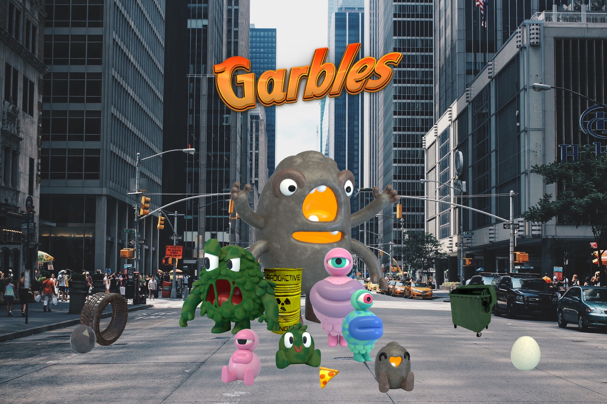

# Garbles Universe

  
 

  
 

  
 

  
 

  

    

      

    

    

  

  

  

## Summary

Welcome to the world of Garbles!&#x20;

\
Trash has become so abundant on our planet that humans don't know how to store it anymore. Luckily, a group of smart scientists (we call them Cleantists) has found a way to cultivate goofy creatures that happen to be the perfect solution to the problem.\
&#x20;\
Garbles are cute, clumsy monsters that originate from garbage. Help them dove into our dumpsters and gobble up every plastic bottle they can find! Every time you create a Garble you are removing actual C02 from the environment. Assemble an army of lovable creatures and embark on a journey to populate the planet...while cleaning it!

****

**Official links**

**🌐** [**Website**](https://www.garbles.fun/)****\
**👾** [**Discord**](https://discord.gg/yKvddrZ25u)****\
**🐦** [**Twitter**](https://twitter.com/garblesfun)
