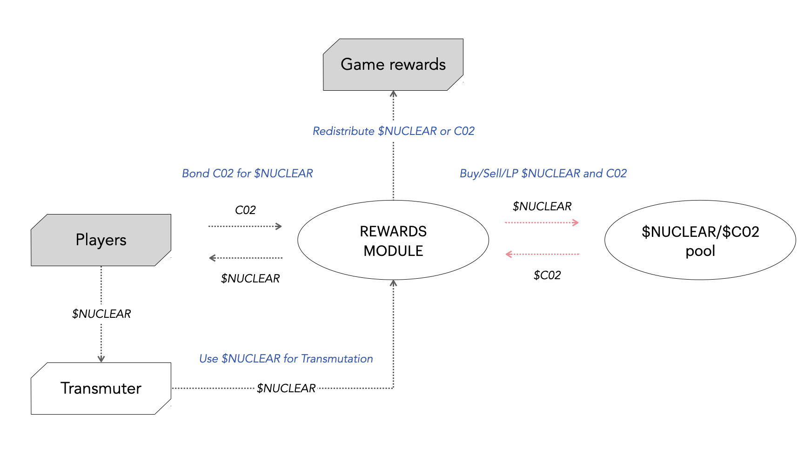

# C02 tokens

**What are carbon credits?**&#x20;

> A carbon credit is a generic term for any tradable certificate or permit representing the right to emit a set amount of carbon dioxide or the equivalent amount of a different greenhouse gas.

**What are C02 tokens?**

C02 tokens are simply an on-chain representation of traditional carbon credits. There are a few projects that tokenize carbon credits from trusted off-chain registries, the leading ones being [Toucan](https://toucan.earth/) and [Moss](https://moss.earth/). Carbon assets on-chain can trade in a non-fungible, semi-fungible or fungible fashion like $BCT (Base Carbon Tonne). You can read more about carbon tokens here. [https://docs.toucan.earth/protocol/pool/key-concepts](https://docs.toucan.earth/protocol/pool/key-concepts). \
\
**What role do C02 tokens play in Garbles?**\
****Higher demand for carbon credits translates into higher incentives for companies to embrace carbon negative/neutral activities for the increased cost in off-setting. Similarly, climate-positive projects that rely on carbon credits to finance themselves, can access startup capital more easily if the demand for carbon credits is strong. Garbles aims to foster the development of the on-chain carbon credit market by making use of C02 as a valuable resource in the game. Players can obtain C02 on the open market and exchange it for NUCLEAR to activate the Transmuter. Another way to earn C02 is through gameplay. By using a real-word assets instead of gems or game credits, players can both have an impact on the environment and make sure their commitments to the game won't be devalued. \
NUCLEAR and C02 committed to the game becomes protocol controlled liquidity that can be deployed actively. The Rewards module governs the inflation rate, redistribution of rewards across the map and can also perform  market operations, such as liquidity provision or swaps. Governance will be able to decide how to make use of excess resources, either by generating additional income streams (i.e. money market/KlimaDAO etc.) or just holding them for the long term while keeping them out from circulation.&#x20;

<figure><figcaption></figcaption></figure>

