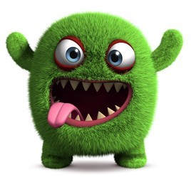

# Garbles

Garbles are the main characters of the game. Invented by Cleantist to help the planet these voracious creatures can gobble up a lot of garbage! Players can generate Garbles to compete for rewards or trade them in the marketplace. Different combinations of Eggs and Trash Objects can produce tens of thousands of different Garbles.

Garbles have the following on-chain properties:

* `DNA` &#x20;
* `Body`
* `Pattern`
* `Arms`
* `Eyes`
* `Crest`
* `Eyes number`
* `Arms number`
* `Mouth`
* `Locomotion`
* `Primary color`
* `Secondary color`
* `Size`
* `Speed`
* `Voracity`

Other attributes are:

* `Happiness`
* `Health`
* `Hunger`

Garbles inherit their traits from the material they are originated. DNA is influenced by `type` of  [Trash Items](resources/nft/trash-items.md) placed in the Transmuter, and so are all other traits. Size, Voracity and Hunger play a role in how fast a garble can consume garbage around the map.

##
