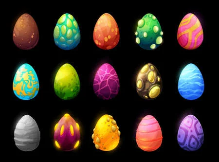

# Eggs

Eggs are one of the main resources to be collected in Exploration mode. Eggs are valuable because they can give birth to Garbles if merged with the right combination of Trash Items. They need a Transmuter (and $NUCLEAR) to hatch and generate a Garble.&#x20;

Eggs have the following traits:

* `Type`
* `Size`

Eggs are themself dependent from the kind of garbage they originate. The most common types of eggs are:&#x20;

* `Plastic`
* `Organic`
* `Oil`
* `Chemical`
* `Radioactive`

There are rumours among Cleantists about the existence of other types of Eggs, but nobody has ever seen them in person.
