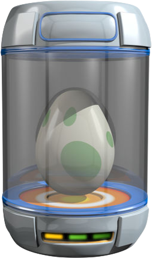

# Transmuters

Transmuters are a technological wonder created by Cleantist. They are the ultimate equipment for building your army of Garbles. Transmuters are used to combine Trash Items with Eggs to generate the hungry creatures. This is because when energized with $NUCLEAR, they are able to trigger a reaction that melts garbage with the outer surface of the egg, causing it to hatch immediately.&#x20;

Transmuters are extremely scarce and can be found and minted around specific point-of-interest on the map in Exploration mode. The lucky owner of a Transmuter can use it in perpetuity and receive a "rent" from other players that want to perform a transmutation themselves. Whoever gets in front of a transmuter can interact with it and a portion of the $NUCLEAR used to trigger the reaction will accrue to the owner. Transmuters can also be accessed remotely, although for a higher amount of $NUCLEAR to account for the dispersion in energy.

